#  RTOS

## 1. FreeRTOS入门

### 1.1 裸机与RTOS介绍

- 裸机：指前后台系统，前台是中断服务函数，后台是main函数里的while(1)大循环，也指应用程序，即裸机由中断服务函数和应用程序两部分组成
  - 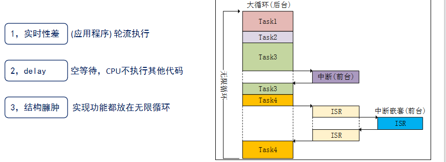
- RTOS：全称Real Time OS，实时操作系统，强调实时性
  - 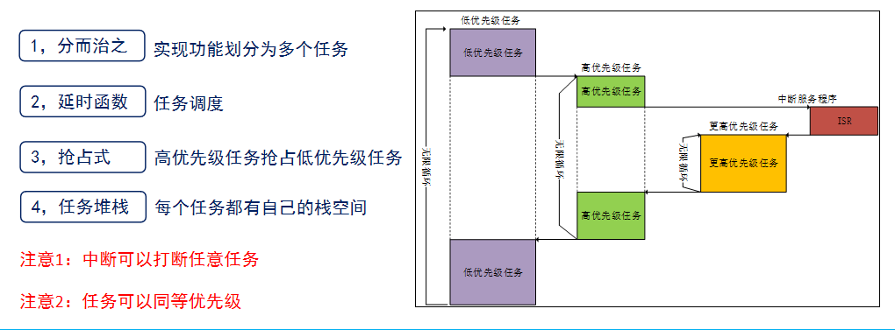

### 1.2 FreeRTOS简介

- FreeRTOS是一款免费的嵌入式实时操作系统

- 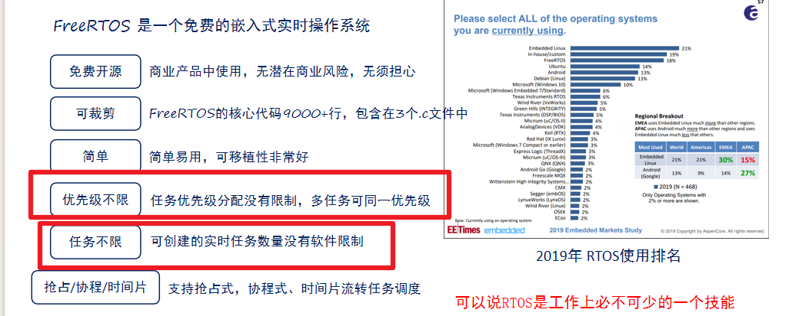

  

## 2. FreeRTOS基础知识

### 2.1 任务调度简介

- 任务调度就是通过相关的调度算法，决定当前需要执行哪个任务
- FreeRTOS有三种任务调度方式
  - 抢占式调度：针对优先级不同的任务，优先级高的任务可以抢占优先级低的任务
    - 任务数值越大，优先级越高
    - 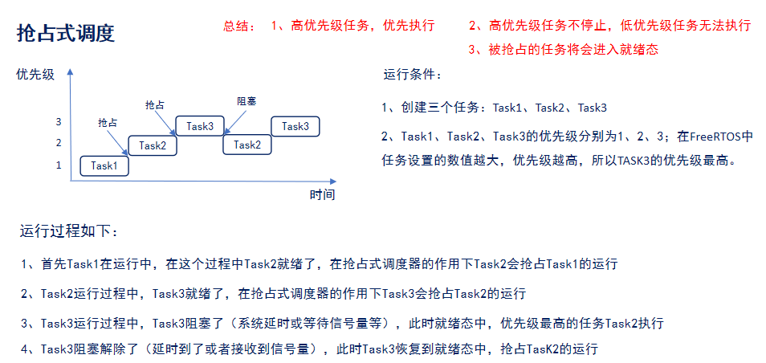
      - 高优先级任务优先执行
      - 高优先级任务不停止，低优先级任务就一直在就绪态等待执行
      - 高优先级任务运行中阻塞时，次高优先级会继续执行，高优先级结束阻塞就会继续抢占执行，次高优先级进入就绪态
      - 被抢占的任务就会进入就绪态
  - 时间片调度：针对优先级相同的任务，任务调度器会在系统滴答定时器的一个周期后切换下一个任务，每个周期执行一个任务，每个任务依次轮换一个周期执行，直到任务都执行完毕
    - 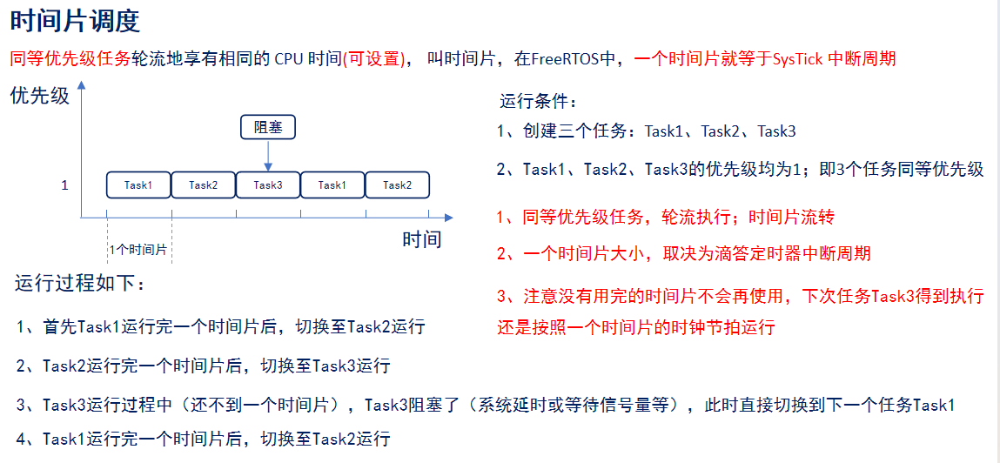
      - 时间片的大小就等于滴答定时器的中断周期
      - 同等优先级任务轮流执行时，没有用完的时间片不会再使用，下次任务执行是按照下一个时间片的时间执行的
      - 任务流转执行时，有一个任务阻塞的话，就直接切换到下一个任务，时间片也按下一个时间片的开始执行
  - 协程式调度：当前执行的任务会一直运行，同时高优先级的不会抢占低优先级的任务，虽然FreeRTOS支持，但是官方不再更新

### 2.2 任务状态

- FreeRTOS中有4种任务状态
  - 运行态：正在执行的任务，在STM32中，同一时间只能一个任务处于运行态
  - 就绪态：该任务已经能够被执行，但当前还未被执行，那么该任务就处于就绪态
  - 阻塞态：任务因延时或等待外部事件发生，就处于阻塞态
  - 挂起态：类似暂停，调用函数 vTaskSuspend() 进入挂起态，需要调用解挂函数vTaskResume()才可以进入就绪态
- 四种任务态之间的转换图
  - 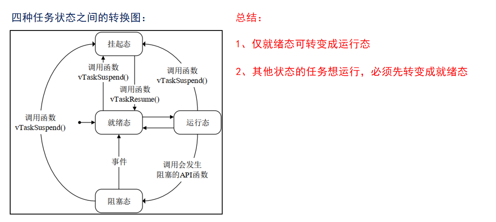
    - 只有就绪态能转为运行态
    - 挂起态需要调用解挂函数进入就绪态，然后从就绪态进入运行态
    - 阻塞态通过事件进入就绪态，然后再通过就绪态进入运行态
- 四种任务状态处理运行态，其他三种任务状态都有对应的任务列表
  - 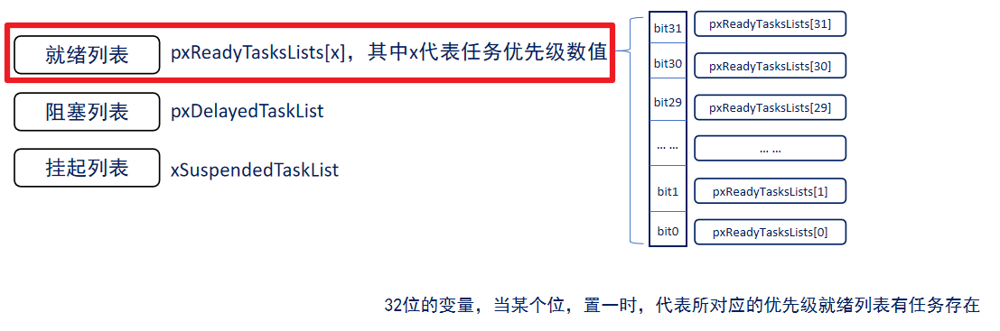
    - 任务优先级数值越大，优先级越高
  - 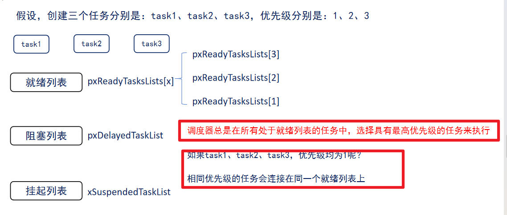
    - 相同优先级的任务会连接在同一个就绪列表上

## 3. FreeRTOS移植

### 3.1 获取FreeRTOS源码

- FreeRTOS官网：https://www.freertos.org/

### 3.2 FreeRTOS手把手移植

- 移植进度
  - 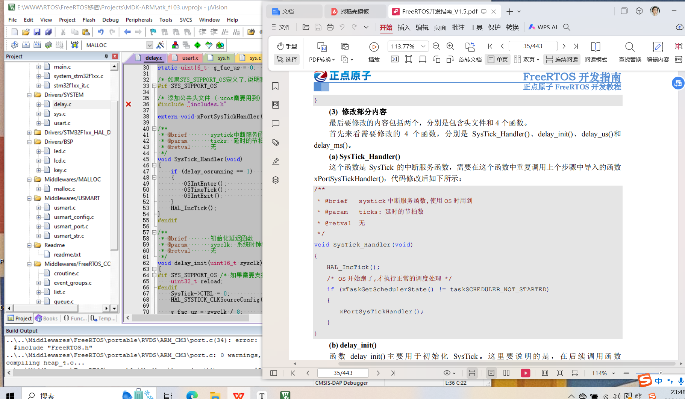

- 目的：实现正点原子开发板的FreeRTOS移植
- 移植准备：FreeRTOS源码、基础的HAL库工程
- 移植步骤
  - 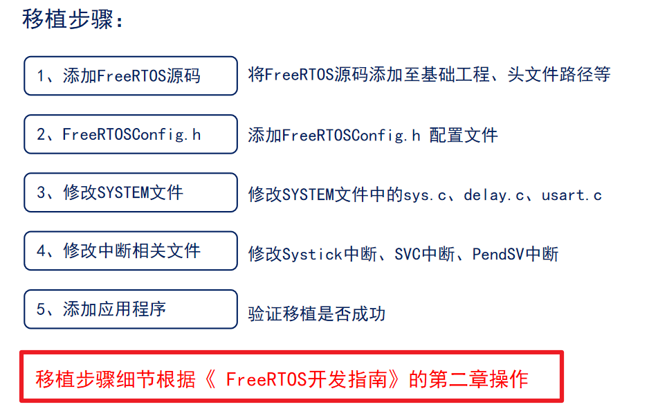

### 3.3 系统配置文件说明

- 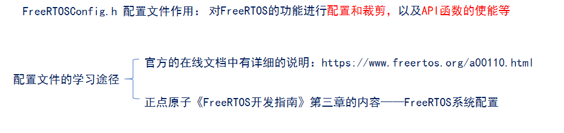
  - 配置文件对FreeRTOS功能进行配置和裁剪，以及API函数的使能
  - 学习路径
    - 官方路径：https://www.freertos.org/a00110.html
    - 正点原子《FreeRTOS开发指南》第三章
- 系统配置文件详解
  - 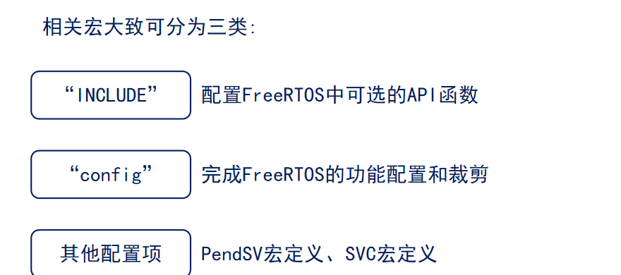
  - 

## 4. FreeRTOS任务创建和删除

### 4.1 任务创建和删除的API函数

- 任务的创建和删除本质上就是调用FreeRTOS的API函数
- 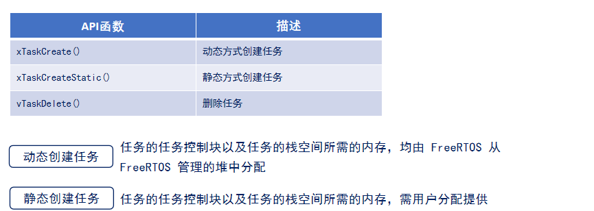
  - 动态创建任务：任务的任务控制块以及任务的栈空间所需要的内存均由FreeRtos由FreeRtos管理的堆中分配
  - 静态创建任务：任务的任务控制块以及任务的栈空间所需要的内存需要用户分配提供

- 动态创建任务函数
  - 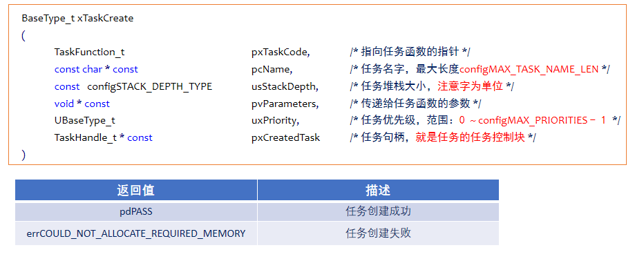
    - 任务优先级，数值越大，任务优先级越高
- 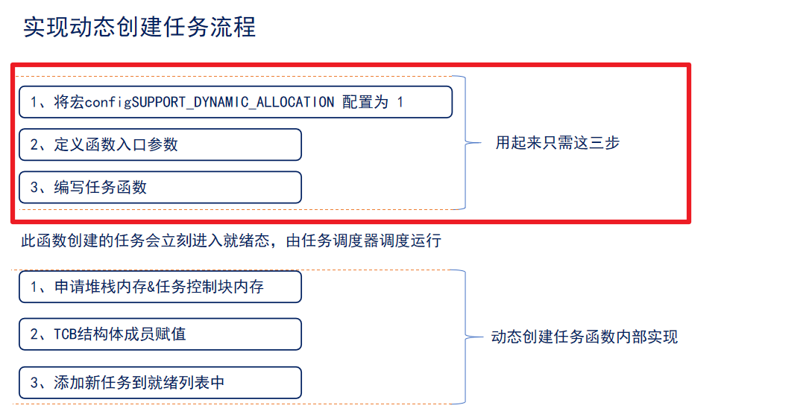
  - 创建完成的任务会立刻进入就绪态
  - TCB：任务控制块，任务身份证

- 任务控制块成员介绍
  - 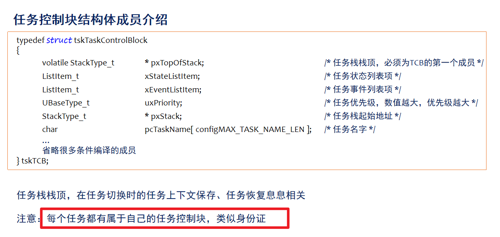
- 静态创建任务函数
  - 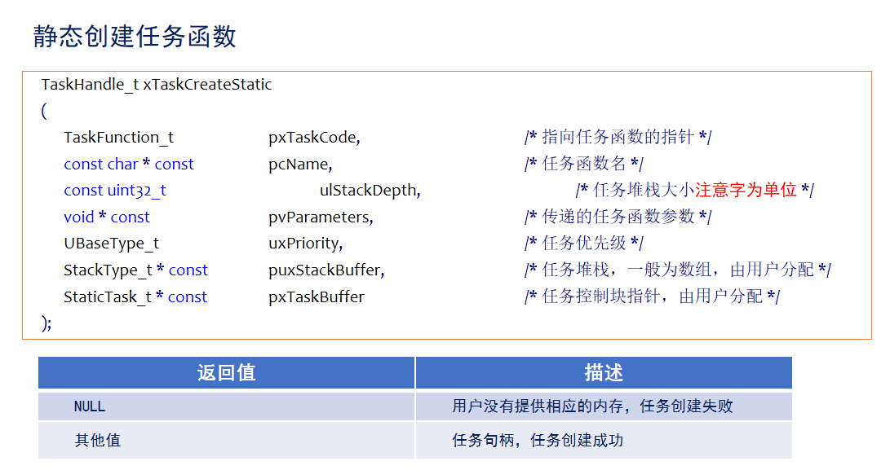
  - 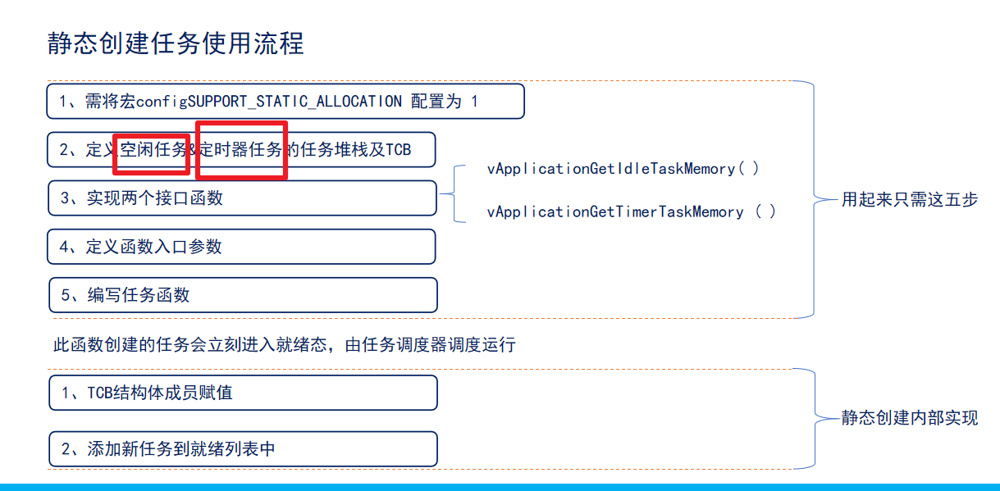
    - 空闲任务一定要有 
- 任务删除函数
  - 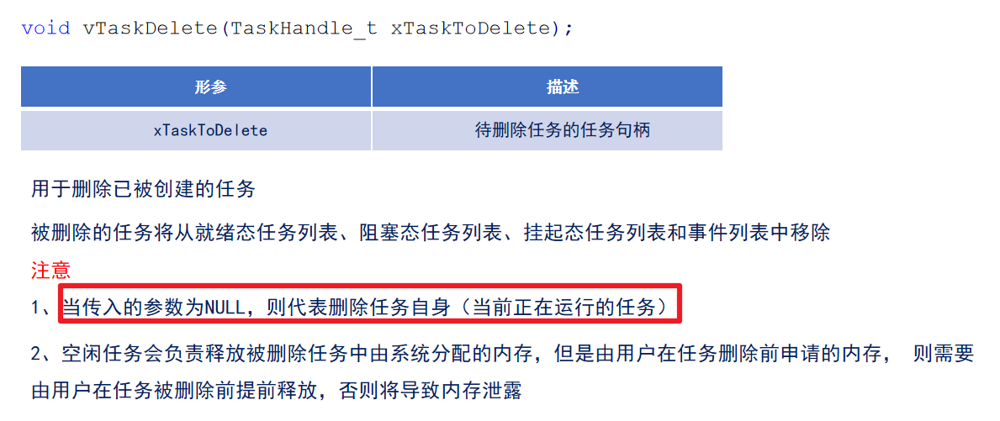
  - 任务删除函数：用于删除已被创建的任务，被删除的任务会从当前任何的任务列表中移除
  - 注意：
    - 传入的参数为NULL时，代表删除任务自身，即正在运行的任务
      - 删除自己时，需要等自己运行完之后，在空闲任务重删除
    - 空闲任务负责释放被删除任务中系统分配的内存，但是由用户在任务被删除前申请的内存，需要由用户在任务被删前提前释放，否则将导致内存泄漏
  - 删除任务流程
    - 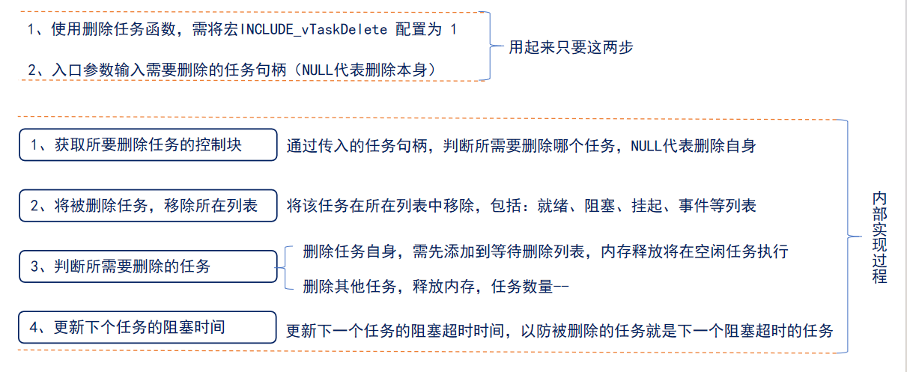

### 4.2 任务创建和删除（动态方法）

- FreeRtos入口函数里定义task_start函数，接着开启函数调度器
- 在task_start函数里开启进入临界区，定义task1/task2/task3三个函数，然后再在ask_start函数里函数自身，之后再退出临界区，因为这三个函数不能重复定义，
- 临界区保证定义的函数不会先执行，等退出临界区后，任务调度器会根据任务优先级调用函数

### 4.3 任务创建和删除（静态方法）

- 

## 5. FreeRTOS任务挂起和恢复

## 6. FreeRTOS中断管理

## 7. FreeRTOS临界段代码保护及任务调度器挂起和恢复

## 8. FreeRTOS列表和列表项

## 9. 任务调度

## 10. 时间片调度

## 11. FreeRTOS任务状态查询API函数介绍

## 12. 时间管理

## 13. FreeRTOS消息队列

## 14. 信号量 

## 15. 队列集

## 16. 事件标志组

## 17. 任务通知

## 18. 软件定时器

## 19. 低功耗模式

## 20. 内存管理