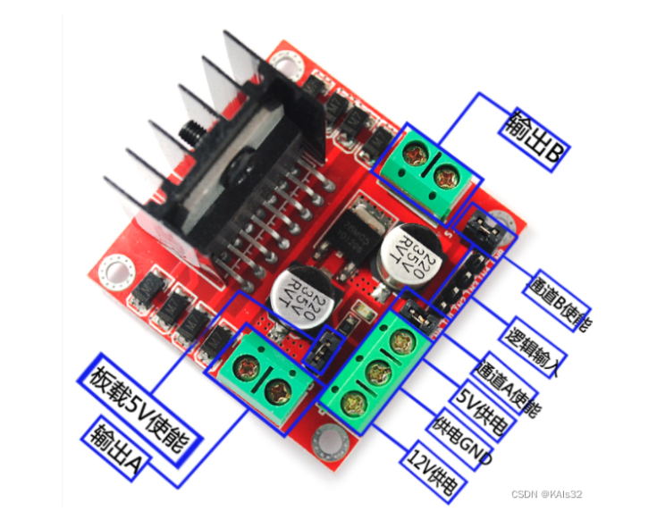

### 1、智能小车

#### 1.1 设计原理

- 硬件模块：主板stm32f103c8t6、四个电机、一个电机驱动模块
  - 基于以上模块，可以实现主板控制小车运行

#### 1.2 硬件设计

- L298N驱动模块

  
  
  - 板载5V使能默认使用跳线帽连接；
  - 12V供电：7~12V均可，供电GND与单片机共地；
  - 5V供电：可引出给单片机供电；
  - 逻辑输入：IN1、IN2、IN3、IN4，IN1、IN2控制输出A，IN3、IN4控制输出B；
    - IN1、IN2：10前进、01后退、00或11停止
  - 通道A使能：单排上面的引脚是高电平，默认A使能都接高，电机转速正常，通道B使能同理；
    - PWM调速原理：不接使能跳线帽，将A、B使能通道分别接两个PWM转空比输出通道，通过调节PWM真空比（高电平占整个周期的宽度）来控制电机的转速
  
  

#### 1.3 软件设计

#### 1.4 成品展示